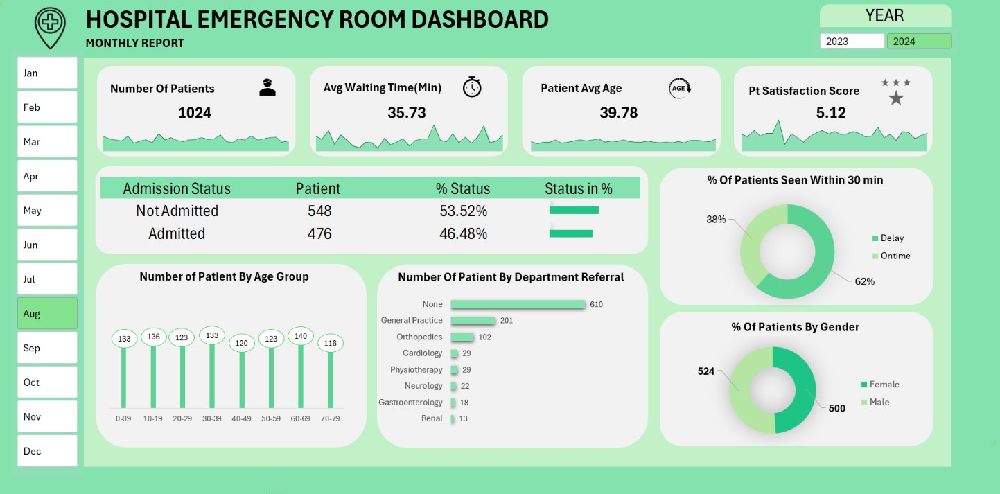
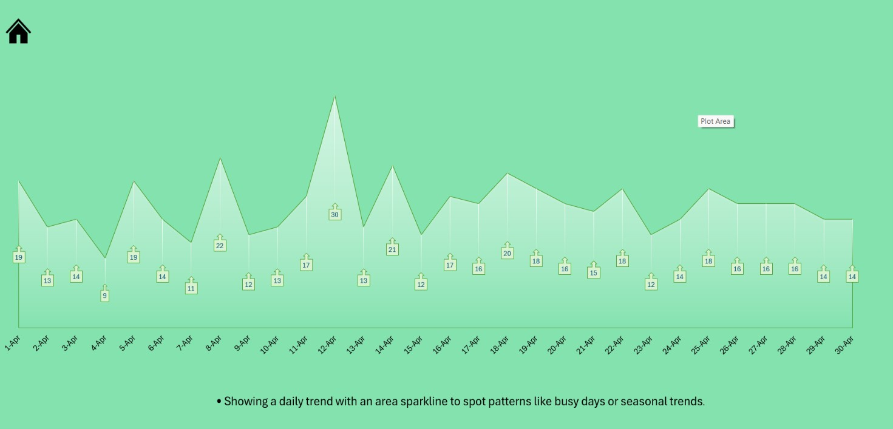
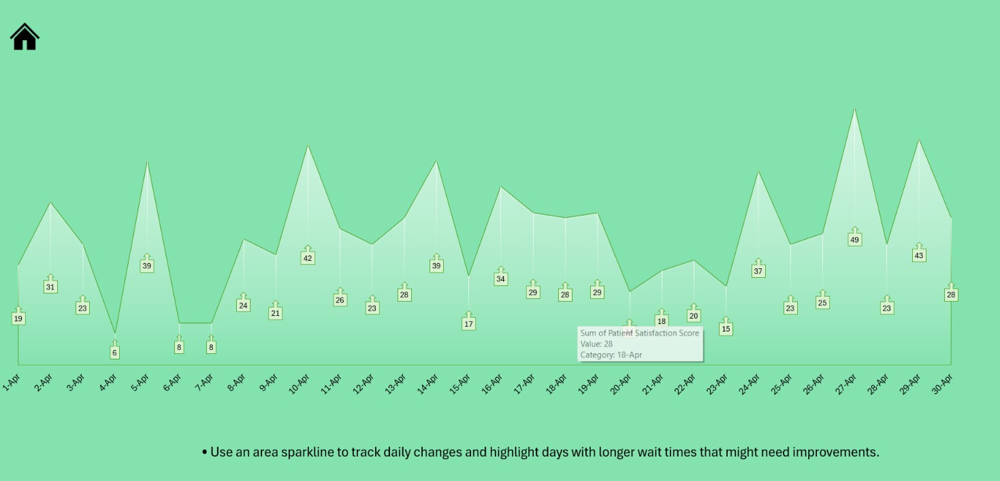
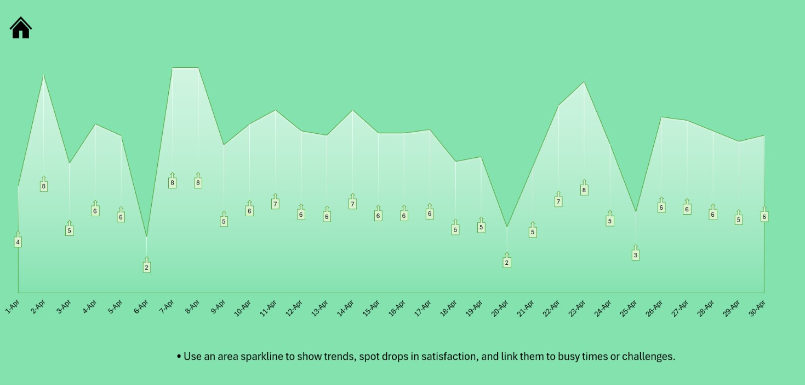
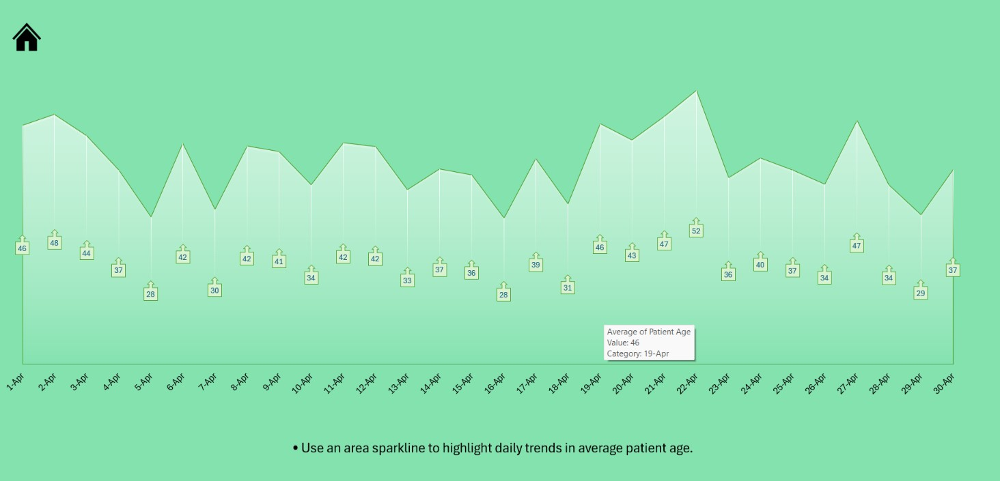

# Hospital-Emergency-Room-Dashboard-Excel
# 🏥 Hospital Emergency Room Business Analysis

> **A business analytics project that transforms emergency room operational data into actionable insights, enabling healthcare administrators to monitor performance, optimize resource allocation, and support data-driven decision-making.**

---

# 📖 Executive Summary

Healthcare organizations generate large volumes of operational data every day, making it challenging to identify meaningful trends using raw spreadsheets alone. This project analyzes emergency room operations to uncover insights into patient flow, waiting time, admissions, patient satisfaction, referral patterns, and demographic trends.

Using Microsoft Power BI, Power Query, and DAX, the dashboard consolidates multiple operational KPIs into a centralized reporting solution that helps stakeholders monitor performance, identify operational bottlenecks, and make informed business decisions.

---

# 🎯 Business Problem

Emergency departments handle a high volume of patients daily. Without a centralized analytical solution, hospital administrators face challenges in:

* Monitoring patient flow efficiently.
* Identifying long waiting times.
* Measuring patient satisfaction.
* Understanding admission and referral trends.
* Allocating medical resources effectively.

This project addresses these challenges by converting operational healthcare data into meaningful business insights.

---

# 🎯 Project Objectives

* Monitor emergency room performance through key healthcare KPIs.
* Analyze patient waiting time and service efficiency.
* Evaluate admission and discharge trends.
* Measure patient satisfaction levels.
* Identify referral and demographic patterns.
* Support operational planning with data-driven insights.

---

# 🛠 Tech Stack

* Microsoft Power BI
* Power Query
* DAX (Data Analysis Expressions)
* Microsoft Excel
* Data Modeling
* Data Cleaning
* Data Visualization

---

# 📂 Dataset Information

| Attribute   | Details                      |
| ----------- | ---------------------------- |
| **Source**  | Kaggle                       |
| **Dataset** | Hospital Emergency Room Data |
| **Format**  | CSV                          |
| **Domain**  | Healthcare Analytics         |

---

# 📊 Business Questions

* How has patient volume changed over time?
* What is the average emergency room waiting time?
* What percentage of patients are admitted versus discharged?
* How satisfied are patients with emergency room services?
* Which departments receive the highest referrals?
* Which age groups visit the emergency room most frequently?
* What are the busiest days and peak operating hours?

---

# 📈 Key Findings

* Identified waiting time trends to evaluate operational efficiency.
* Measured admission and discharge patterns to understand emergency room utilization.
* Analyzed patient satisfaction scores to evaluate healthcare service quality.
* Identified peak operating hours and busiest weekdays for workforce planning.
* Examined referral patterns across hospital departments.
* Analyzed demographic distribution to better understand patient demand.
* Developed dynamic KPIs using DAX measures for interactive business analysis.

---

# 💼 Business Impact

* Centralized multiple healthcare KPIs into a single reporting solution.
* Improved visibility into patient flow, waiting time, admissions, referrals, and satisfaction metrics.
* Enabled dynamic business analysis through DAX-powered calculations and interactive filtering.
* Supported operational planning with interactive and real-time reporting.
* Delivered actionable insights to improve resource allocation and emergency room efficiency.

---

# 📷 Dashboard Preview

## Hospital Emergency Room Dashboard



## Supporting Visualizations

### Daily Patient Trend



### Daily Waiting Time Trend



### Patient Satisfaction Trend



### Average Patient Age Trend



---

# 📁 Repository Structure

```text
Hospital-Emergency-Room-Business-Analysis
│
├── README.md
├── Hospital Emergency Room Dashboard.pbix
├── Hospital Emergency Room Data.csv
│
└── dashboard-images
    ├── Hospital_Emergency_Room_Dashboard.jpg
    ├── Daily_Patient_Trend.jpg
    ├── Daily_Waiting_Time_Trend.jpg
    ├── Patient_Satisfaction_Trend.jpg
    └── Average_Patient_Age_Trend.jpg
```

---

# 🚀 Skills Demonstrated

* Business Analysis
* Healthcare Analytics
* Microsoft Power BI
* Power Query
* DAX
* Data Modeling
* KPI Development
* Data Cleaning
* Data Visualization
* Dashboard Design
* Business Intelligence
* Analytical Thinking

---

# 🔄 Continuous Improvement

This project demonstrates my approach to solving business problems through analytics rather than simply building dashboards. I continuously refine my skills in data modeling, business analysis, and data storytelling. Constructive feedback and suggestions are always welcome to further enhance the analytical depth and business value of this project.

---
### Connect With Me

* **GitHub:** https://github.com/neerajsahu-git
* **LinkedIn:** https://www.linkedin.com/in/neerajkumarsahu-data
